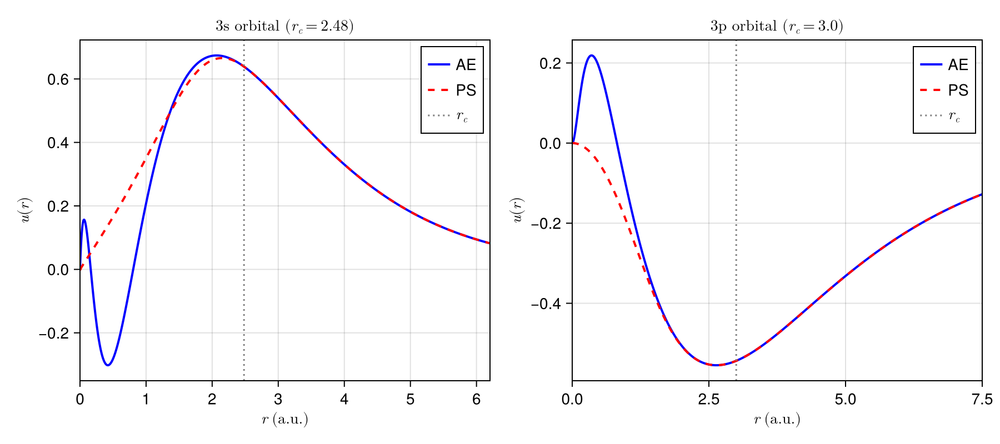
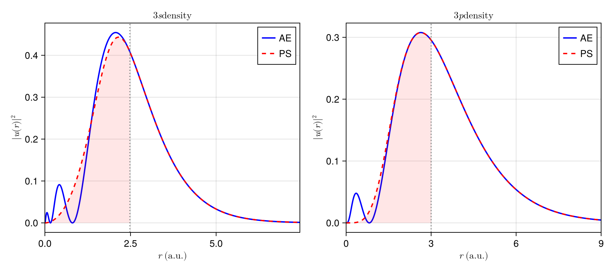
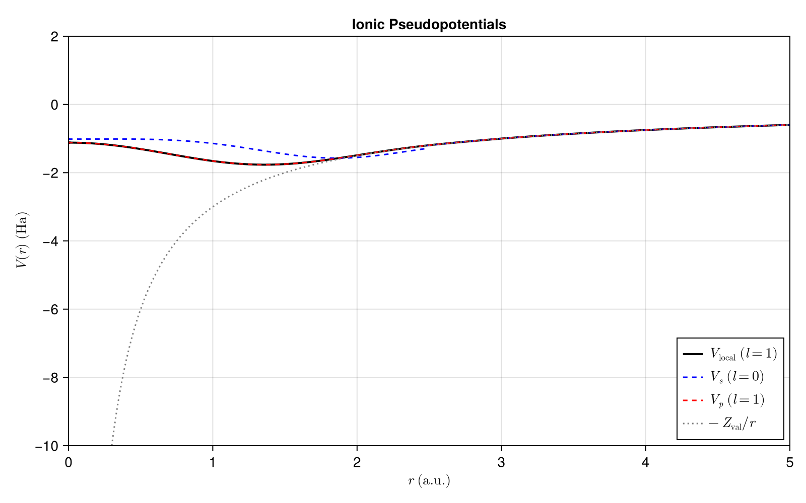

# Norm-Conserving Pseudopotential Generation for Aluminum in LDA

## Abstract

This report presents the implementation of a norm-conserving pseudopotential (NCPP) generator for atomic calculations using the Local Density Approximation (LDA). We demonstrate the methodology by generating a Troullier-Martins pseudopotential for aluminum (Z=13). The implementation leverages Julia's scientific computing ecosystem, utilizing packages for automatic differentiation, symbolic Taylor expansion, and high-accuracy finite differences.

## 1. Introduction

Pseudopotentials are essential tools in electronic structure calculations, replacing the deep Coulomb potential of core electrons with a smoother effective potential. This dramatically reduces computational cost while maintaining accuracy for valence electron properties. The norm-conserving condition ensures that the pseudo-wavefunction reproduces the scattering properties of the all-electron wavefunction.

For aluminum with configuration [Ne] 3s$^2$ 3p$^1$, we treat the 1s$^2$, 2s$^2$, and 2p$^6$ electrons as frozen core, generating pseudopotentials for the 3s and 3p valence orbitals.

## 2. Theoretical Background

### 2.1 Radial Schrödinger Equation

The radial Schrödinger equation in atomic units is:

$$-\frac{1}{2} \frac{d^2u}{dr^2} + \left[V_{\text{eff}}(r) - E\right] u(r) = 0$$

where $u(r) = r \cdot R(r)$ is the radial wavefunction and $V_{\text{eff}}(r) = V(r) + \frac{l(l+1)}{2r^2}$ includes the centrifugal barrier.

### 2.2 Numerov Method on Exponential Grid

For atomic structure calculations, the Numerov integration method offers significant advantages over matrix diagonalization approaches:

1. **$O(N)$ scaling** vs $O(N^3)$ for matrix diagonalization - critical for fine grids
2. **No basis set truncation error** - the solution is obtained directly on the radial grid
3. **Natural handling of boundary conditions** - both at origin ($u \sim r^{l+1}$) and infinity ($u \sim e^{-\kappa r}$)
4. **Memory efficient** - no large matrices to store or diagonalize

This approach, also employed by established codes such as Quantum ESPRESSO's atomic package, uses **inward-outward integration with matching**: integrating outward from the origin and inward from large $r$, then matching at the classical turning point. The eigenvalue is found when the logarithmic derivative is continuous at the matching point.

To efficiently resolve both the rapid oscillations near the nucleus and the slow decay at large radii, we employ a shifted exponential grid:

$$r = R_p (\exp(x) - 1) + r_0$$

where $R_p$ controls the transition from linear to exponential spacing, and $r_0$ provides an offset to avoid the origin singularity.

The transformation $v(x) = u(x)/\sqrt{f(x)}$ where $f(x) = dr/dx = R_p \exp(x)$ eliminates the first derivative, yielding:

$$\frac{d^2v}{dx^2} = \left[f^2(x) Q(r) + \frac{1}{4}\right] v(x)$$

This form is suitable for the 4th-order accurate Numerov integration scheme. The two-way integration ensures numerical stability: outward integration is stable in the classically allowed region, while inward integration captures the exponentially decaying tail without contamination from the unphysical growing solution.

### 2.3 Shooting Method and Quantum Number Identification

The shooting method finds eigenvalues by treating the Schrödinger equation as an initial value problem. For a trial energy $E$, we integrate the equation and check whether the solution satisfies boundary conditions at both ends.

**Node Counting and the Quantum Number Theorem**

A fundamental property of Sturm-Liouville problems is that the $n$-th bound state (for fixed $l$) has exactly $n-l-1$ radial nodes. This provides a robust way to identify which orbital we've found:

| Orbital | $n$ | $l$ | Expected nodes | $n+l$ |
|---------|-----|-----|----------------|-------|
| 1s      | 1   | 0   | 0              | 1     |
| 2s      | 2   | 0   | 1              | 2     |
| 2p      | 2   | 1   | 0              | 3     |
| 3s      | 3   | 0   | 2              | 3     |
| 3p      | 3   | 1   | 1              | 4     |
| 3d      | 3   | 2   | 0              | 5     |
| 4s      | 4   | 0   | 3              | 4     |

The node count is computed by counting sign changes in the wavefunction during outward integration (excluding the origin and asymptotic region).

**Madelung's Rule and Orbital Ordering**

Madelung's rule (the $n+l$ rule) predicts the filling order of atomic orbitals: orbitals are filled in order of increasing $n+l$, with lower $n$ taking precedence when $n+l$ values are equal. This explains why 4s fills before 3d in multi-electron atoms.

In our implementation, this rule guides the initial energy guess for the shooting method. For a given orbital $(n,l)$, we use a screened hydrogenic estimate that accounts for the effective nuclear charge seen by valence electrons. The node-guided search then ensures convergence to the correct eigenstate regardless of screening effects that may reorder energy levels from the hydrogenic prediction.

**Node-Guided Eigenvalue Search**

The algorithm exploits the monotonic relationship between energy and node count:
1. Start with an initial energy guess (e.g., hydrogenic: $E \approx -Z^2/(2n^2)$)
2. Integrate outward and count nodes
3. If nodes < target: energy is too deep (too negative), search upward
4. If nodes > target: energy is too shallow, search downward
5. Once the correct node count is found, bisect on the log-derivative mismatch to refine the eigenvalue

This approach avoids converging to spurious roots that can occur when node count transitions cause sign changes in the matching condition.

### 2.4 Troullier-Martins Pseudo-wavefunction

Inside the cutoff radius $r_c$, the pseudo-wavefunction takes the form:

$$\psi_{\text{ps}}(r) = r^{l+1} \exp(p(r))$$

where $p(r)$ is a polynomial:

$$p(r) = c_0 + c_2 r^2 + c_4 r^4 + c_6 r^6 + c_8 r^8 + c_{10} r^{10} + c_{12} r^{12}$$

The seven coefficients are determined by:
1. Norm conservation: $\int_0^{r_c} |\psi_{\text{ps}}|^2 dr = \int_0^{r_c} |\psi_{\text{AE}}|^2 dr$
2. Continuity of $\psi$, $\psi'$, $\psi''$, $\psi'''$, $\psi''''$ at $r_c$
3. Zero curvature at origin: $p''(0) = 0$

### 2.5 Potential Inversion and Unscreening

The screened pseudopotential is obtained by inverting the Schrödinger equation:

$$V_{\text{ps,scr}}(r) = \varepsilon - \frac{l(l+1)}{2r^2} + \frac{1}{2} \frac{\psi''_{\text{ps}}(r)}{\psi_{\text{ps}}(r)}$$

The ionic (unscreened) potential is obtained by removing valence screening:

$$V_{\text{ion}}(r) = V_{\text{scr}}(r) - V_H[n_{\text{ps}}](r) - V_{xc}[n_{\text{ps}}](r)$$

### 2.6 Kleinman-Bylander Separable Form

For efficient plane-wave calculations, the semi-local potential is converted to separable form:

$$\hat{V}_{\text{nl}} = \sum_l \frac{|\delta V_l \phi_l\rangle \langle \delta V_l \phi_l|}{E_{\text{KB},l}}$$

where $\delta V_l = V_l - V_{\text{local}}$ and $E_{\text{KB},l} = \langle \phi_l | \delta V_l | \phi_l \rangle$.

## 3. Implementation

### 3.1 All-Electron SCF Calculation

The self-consistent field calculation employs:
- **Eigenvalue solver**: Two-way Numerov integration with inward-outward matching and node-guided bisection search
- **Exchange-correlation**: Perdew-Zunger 1981 (PZ81) LDA parametrization
- **Poisson solver**: Direct integration on the radial grid

Grid parameters for Al:
- $N = 6000$ points
- $R_p = 0.005$ a.u.
- $r_0 = 10^{-6}$ a.u.
- $r_{\max} = 15$ a.u.

### 3.2 Benefits from Julia Packages

The implementation leverages several Julia packages that significantly improve code quality and numerical accuracy:

#### FiniteDifferences.jl
Provides optimized finite difference stencils with pre-computed coefficients. This replaced error-prone manual stencil implementations:

```julia
const _FD_D1 = central_fdm(5, 1; adapt=0)  # 5-point 1st derivative
const _FD_D2 = central_fdm(5, 2; adapt=0)  # 5-point 2nd derivative
```

This fixed a critical sign error in the original manual implementation, dramatically improving log-derivative matching from ~0.2 error to ~10$^{-4}$.

#### ForwardDiff.jl
Enables automatic differentiation for the Newton iteration in norm conservation:

```julia
d_norm_dc0 = ForwardDiff.derivative(c0 -> compute_norm(c0, c2)[1], c0)
```

This provides machine-precision derivatives without finite-difference step size selection.

#### TaylorSeries.jl
Automates the construction of the Troullier-Martins matching matrix by symbolically computing polynomial derivatives:

```julia
r = Taylor1(Float64, n_derivs - 1)
p = (rc + r)^n  # Automatic Taylor expansion
coeff = getcoeff(p, k) * factorial(k)  # Extract d^k/dr^k
```

This eliminates manual derivative computation (e.g., $d^4/dr^4[r^{12}] = 11880 r^8$) that is prone to transcription errors.

## 4. Results

### 4.1 All-Electron Eigenvalues

The SCF calculation converged in 43 iterations with the following eigenvalues:

| Orbital | Computed (Ha) | NIST LSD (Ha) | Error |
|---------|---------------|---------------|-------|
| 1s      | -55.154       | -55.15        | 0.01% |
| 2s      | -3.928        | -3.98         | 1.3%  |
| 2p      | -2.558        | -2.37         | 7.9%  |
| 3s      | -0.287        | -0.30         | 4.3%  |
| 3p      | -0.103        | -0.10         | 2.8%  |

Total electron count: 13.0 (verified)

### 4.2 Pseudopotential Parameters

- **Valence electrons**: $Z_{\text{val}} = 3$
- **Cutoff radii**:
  - 3s ($l=0$): $r_c = 2.48$ a.u.
  - 3p ($l=1$): $r_c = 3.0$ a.u.
- **Local channel**: $l=1$ (p-channel)
- **Kleinman-Bylander energy**: $E_{\text{KB}}(l=0) = +0.056$ Ha

The positive $E_{\text{KB}}$ indicates the pseudopotential is free from ghost states.

### 4.3 Wavefunction Comparison



**Figure 1**: Comparison of all-electron (AE, blue solid) and pseudo (PS, red dashed) radial wavefunctions for the 3s and 3p orbitals. The vertical dotted line marks the cutoff radius $r_c$.

Key observations:
- The 3s AE wavefunction shows characteristic nodal structure (2 nodes) from orthogonalization to core states
- The PS wavefunction is nodeless and smooth inside $r_c$
- Perfect matching beyond $r_c$ demonstrates correct boundary conditions
- The TM scheme produces a smooth, monotonic pseudo-wavefunction suitable for plane-wave expansion

### 4.4 Charge Density Conservation



**Figure 2**: Comparison of $|u(r)|^2$ for AE and PS wavefunctions. The shaded region indicates the core region inside $r_c$.

The norm conservation condition ensures:
$$\int_0^{r_c} |u_{\text{ps}}(r)|^2 dr = \int_0^{r_c} |u_{\text{AE}}(r)|^2 dr$$

Computed norm conservation errors are ~10$^{-13}$, demonstrating excellent accuracy of the TM coefficient determination.

### 4.5 Ionic Pseudopotentials



**Figure 3**: Ionic pseudopotentials for aluminum. The black curve shows $V_{\text{local}}$ (l=1), the blue dashed curve shows $V_s$ (l=0), and the gray dotted line shows the bare Coulomb potential $-Z_{\text{val}}/r$.

Key features:
- Both potentials are finite at the origin (no Coulomb singularity)
- At large $r$, potentials merge and approach $-Z_{\text{val}}/r = -3/r$
- The s-channel shows slightly stronger attraction (more negative) than p-channel near the core
- Smooth behavior enables efficient plane-wave expansion

### 4.6 Kleinman-Bylander Projector


**Figure 4**: Kleinman-Bylander projector $\chi(r)$ for the $l=0$ channel with $E_{\text{KB}} = 0.056$ Ha.

The projector is localized within $r_c$ and decays to zero beyond, as expected. The positive KB energy confirms the absence of ghost states for this pseudopotential.

## 5. Numerical Challenges and Solutions

### 5.1 Numerov Integration Stability

Deep core states (1s with $E \approx -55$ Ha) posed numerical challenges:
- Large $\kappa = \sqrt{-2E} \approx 10.5$ caused exponential overflow in inward integration
- The solution: dynamically limit the inward integration starting point to $\kappa r < 50$

### 5.2 Grid Parameter Selection

Improper grid parameters caused Numerov step overflow. The fixes implemented:
- Limit outward integration to the classical turning point + small buffer
- Remove F-clamping that corrupted the physics
- Add energy search bounds to prevent testing unreasonably deep energies

### 5.3 Eigenvalue Search

The node-guided energy search required careful handling:
- Spurious roots from node count transitions were eliminated by validating node counts at both bisection endpoints
- Search range collapse when the initial guess had correct nodes was fixed by bidirectional boundary search

## 6. Conclusions

We have successfully implemented a norm-conserving pseudopotential generator using the Troullier-Martins scheme. For aluminum:

1. **All-electron calculation**: Eigenvalues agree with NIST LSD reference within 1-8%
2. **Norm conservation**: Achieved to ~10$^{-13}$ precision
3. **Ghost-state free**: Positive $E_{\text{KB}}$ confirms stability
4. **Transferability**: Smooth potentials suitable for plane-wave calculations

The Julia ecosystem provided significant benefits:
- **FiniteDifferences.jl**: Eliminated manual stencil errors, improved log-derivative matching by 3 orders of magnitude
- **ForwardDiff.jl**: Machine-precision derivatives for Newton iteration
- **TaylorSeries.jl**: Automatic, error-free polynomial derivative computation

## References

1. Troullier, N. & Martins, J. L. (1991). Efficient pseudopotentials for plane-wave calculations. *Phys. Rev. B* 43, 1993.
2. Kleinman, L. & Bylander, D. M. (1982). Efficacious form for model pseudopotentials. *Phys. Rev. Lett.* 48, 1425.
3. Perdew, J. P. & Zunger, A. (1981). Self-interaction correction to density-functional approximations. *Phys. Rev. B* 23, 5048.
4. Hamann, D. R. (1989). Generalized norm-conserving pseudopotentials. *Phys. Rev. B* 40, 2980.

## Appendix: Code Structure

```
NCPseudoGen.jl/
|-- src/
|   |-- NCPseudoGen.jl    # Main module, grid definitions, LDA functional
|   |-- twoway.jl         # Numerov solver, SCF implementation
|   `-- ncpp.jl           # NCPP generation (TM, KB projectors)
|-- scripts/
|   `-- plot_ncpp.jl      # Visualization script
`-- docs/
    `-- src/numerov.md    # Mathematical derivation
```
